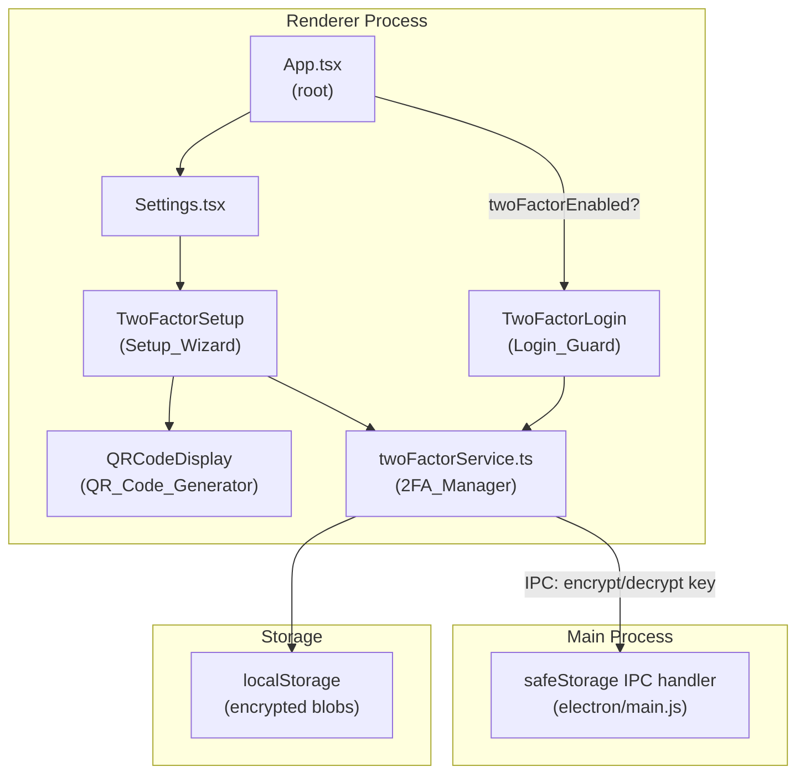
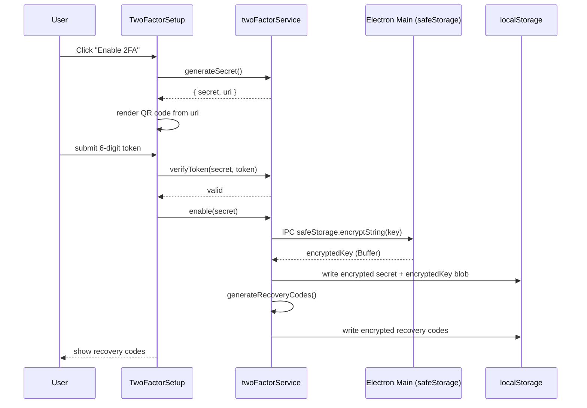
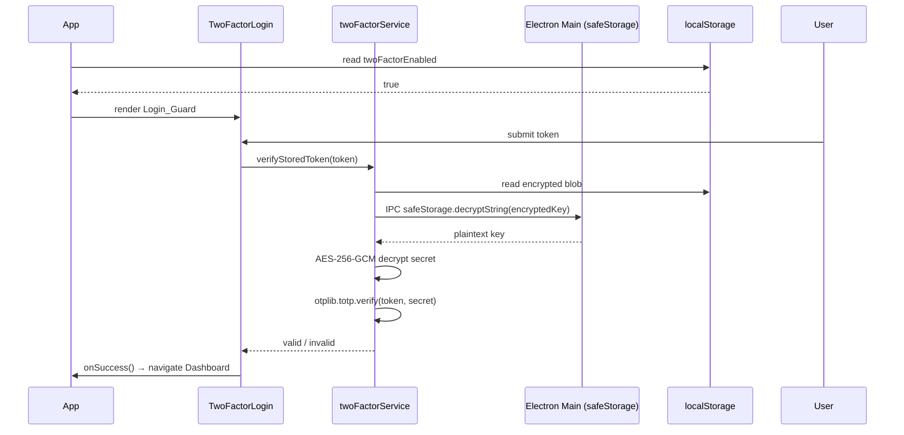

# Design Document: TOTP Two-Factor Authentication

## Overview

This feature adds client-side TOTP-based 2FA to SocialFlow Desktop (Electron + React/TypeScript). Because there is no backend, all TOTP logic — secret generation, token verification, recovery code management, and encrypted storage — runs entirely in the renderer/main process using Node.js built-ins and third-party libraries.

The implementation introduces three new modules:

- `services/twoFactorService.ts` — the **2FA_Manager**: pure business logic, no React
- `components/TwoFactorSetup.tsx` — the **Setup_Wizard**: guides enable/disable flow
- `components/TwoFactorLogin.tsx` — the **Login_Guard**: challenges the user at app start when 2FA is enabled

Encryption uses `Electron.safeStorage` (OS keychain) to derive a key that is never stored in plaintext alongside the ciphertext. Encrypted blobs are written to `localStorage` (renderer-accessible) via a thin IPC bridge.

### Libraries

| Library | Purpose |
|---|---|
| `otplib` | TOTP secret generation and token verification (RFC 6238) |
| `qrcode` | QR code rendering from `otpauth://` URI |
| Node.js `crypto` | AES-256-GCM encryption / decryption |
| Electron `safeStorage` | OS-level key derivation (wraps OS keychain) |

---

## Architecture

### Component Diagram



### Data Flow: Enable 2FA



### Data Flow: Login Guard



---

## Components and Interfaces

### twoFactorService.ts (2FA_Manager)

```typescript
interface TwoFactorService {
  // Secret lifecycle
  generateSecret(accountLabel: string): { secret: string; uri: string };
  verifyToken(secret: string, token: string): boolean;
  verifyStoredToken(token: string): Promise<boolean>;

  // Enable / disable
  enable(secret: string): Promise<void>;
  disable(): Promise<void>;
  isEnabled(): boolean;

  // Recovery codes
  generateRecoveryCodes(): string[];           // 8 × 10-char alphanumeric
  verifyRecoveryCode(code: string): Promise<boolean>;
  regenerateRecoveryCodes(): Promise<string[]>;
  getRemainingRecoveryCodeCount(): Promise<number>;

  // Rate limiting
  recordFailedAttempt(): void;
  isLockedOut(): boolean;
  getLockoutRemainingMs(): number;
  resetFailedAttempts(): void;
}
```

### TwoFactorSetup (Setup_Wizard)

Props:
```typescript
interface TwoFactorSetupProps {
  onSetupComplete: () => void;
  onDisableComplete: () => void;
  onCancel: () => void;
}
```

Internal state machine:
```
IDLE → GENERATING → QR_DISPLAY → CONFIRMING → SHOWING_CODES → DONE
IDLE → DISABLING → CONFIRM_DISABLE → DONE
```

### TwoFactorLogin (Login_Guard)

Props:
```typescript
interface TwoFactorLoginProps {
  onSuccess: () => void;
}
```

Internal state:
```typescript
interface LoginGuardState {
  mode: 'totp' | 'recovery';
  failedAttempts: number;
  lockedUntil: number | null;   // epoch ms
  error: string | null;
}
```

### QRCodeDisplay

Props:
```typescript
interface QRCodeDisplayProps {
  uri: string;          // otpauth://totp/... URI
  secret: string;       // Base32 fallback
}
```

Renders a `<canvas>` via `qrcode.toCanvas()` with error correction level `M`.

### IPC Bridge (electron/main.js additions)

Two new IPC handlers exposed via `contextBridge`:

```typescript
// preload.js additions
window.electronAPI.encryptString(plaintext: string): Promise<string>  // base64
window.electronAPI.decryptString(ciphertext: string): Promise<string>
```

Main process handlers use `safeStorage.encryptString` / `safeStorage.decryptString`.

---

## Data Models

### User_Store Extension

Stored in `localStorage` under key `sf_user_2fa`:

```typescript
interface TwoFactorUserStore {
  twoFactorEnabled: boolean;
  // AES-256-GCM encrypted TOTP secret
  encryptedSecret: string;      // base64(iv + authTag + ciphertext)
  // safeStorage-encrypted AES key
  encryptedKey: string;         // base64 of safeStorage output
}
```

### Recovery_Code_Store

Stored in `localStorage` under key `sf_recovery_codes`:

```typescript
interface RecoveryCodeStore {
  // AES-256-GCM encrypted JSON blob
  encryptedCodes: string;       // base64(iv + authTag + ciphertext)
  encryptedKey: string;         // base64 of safeStorage output
}

// Plaintext structure (before encryption)
interface RecoveryCodeData {
  codes: Array<{
    code: string;               // 10-char alphanumeric
    consumed: boolean;
  }>;
}
```

### Encryption Scheme

```
AES key (32 bytes random)
  └─ encrypted by safeStorage.encryptString → encryptedKey (stored)
  └─ used to AES-256-GCM encrypt the secret/codes → encryptedSecret (stored)

Encrypted blob layout: [ IV (12 bytes) | authTag (16 bytes) | ciphertext ]
Stored as base64 string.
```

The AES key itself is never stored in plaintext. It is wrapped by the OS keychain via `safeStorage`, so an attacker with only the `localStorage` dump cannot decrypt the secret without also compromising the OS keychain entry.

### Rate Limiting State

Stored in memory only (not persisted — resets on app restart):

```typescript
interface RateLimitState {
  failedAttempts: number;
  lockedUntil: number | null;   // Date.now() + 5 * 60 * 1000
}
```

---

## Correctness Properties

*A property is a characteristic or behavior that should hold true across all valid executions of a system — essentially, a formal statement about what the system should do. Properties serve as the bridge between human-readable specifications and machine-verifiable correctness guarantees.*


### Property 1: Generated secrets meet minimum entropy

*For any* call to `generateSecret()`, the returned Base32-encoded secret must decode to a byte array of at least 20 bytes (160 bits).

**Validates: Requirements 1.2**

### Property 2: TOTP URI format and issuer

*For any* account label and generated secret, the URI produced by `generateSecret()` must begin with `otpauth://totp/`, contain the account label, contain the secret as a `secret=` query parameter, and contain `issuer=SocialFlow`.

**Validates: Requirements 1.3, 6.1, 6.2**

### Property 3: URI secret round-trip

*For any* TOTP secret, encoding it into a `otpauth://totp/` URI and then extracting and Base32-decoding the `secret=` parameter from that URI must produce the original secret value.

**Validates: Requirements 6.3**

### Property 4: Current TOTP token always verifies

*For any* generated TOTP secret, computing the current TOTP token with `otplib` and immediately passing it to `verifyToken(secret, token)` must return `true`.

**Validates: Requirements 1.5, 3.2**

### Property 5: Enable persists 2FA state

*For any* valid TOTP secret, calling `enable(secret)` followed by `isEnabled()` must return `true`, and calling `verifyStoredToken(currentToken)` must return `true` (i.e., the secret survives the encrypt/store/decrypt round-trip).

**Validates: Requirements 1.7**

### Property 6: Recovery code format invariant

*For any* call to `generateRecoveryCodes()`, the result must be an array of exactly 8 strings, each matching the pattern `[A-Za-z0-9]{10}`.

**Validates: Requirements 2.1**

### Property 7: Recovery codes are not stored in plaintext

*For any* set of recovery codes persisted via the Recovery_Code_Store, the raw string value written to `localStorage` must not contain any of the plaintext code strings.

**Validates: Requirements 2.4, 5.2**

### Property 8: Recovery codes are single-use

*For any* valid unused recovery code, calling `verifyRecoveryCode(code)` the first time must return `true` and mark the code consumed; calling `verifyRecoveryCode(code)` a second time with the same code must return `false`.

**Validates: Requirements 2.5**

### Property 9: Regeneration invalidates all prior codes

*For any* set of previously issued recovery codes, after calling `regenerateRecoveryCodes()`, every code from the prior set must be rejected by `verifyRecoveryCode()`.

**Validates: Requirements 2.7**

### Property 10: Failed attempt counter increments on invalid token

*For any* invalid TOTP token submitted to the Login_Guard, the internal `failedAttempts` counter must increase by exactly 1 after each rejection.

**Validates: Requirements 3.4**

### Property 11: Lockout activates after 5 failures

*For any* sequence of exactly 5 consecutive invalid token submissions, `isLockedOut()` must return `true` and `getLockoutRemainingMs()` must return a value close to 5 minutes (300 000 ms).

**Validates: Requirements 3.5**

### Property 12: Replay attack prevention

*For any* TOTP token that has already been successfully verified within the current 30-second window, a second call to `verifyStoredToken(token)` with the same token must return `false`.

**Validates: Requirements 3.7**

### Property 13: Disable clears all 2FA state

*For any* enabled 2FA configuration, calling `disable()` must result in `isEnabled()` returning `false`, the `sf_user_2fa` localStorage entry having `twoFactorEnabled: false` with no recoverable secret, and all previously valid recovery codes being rejected.

**Validates: Requirements 4.3**

### Property 14: Secret and key are not stored in plaintext

*For any* TOTP secret passed to `enable()`, the raw string stored in `localStorage` under `sf_user_2fa` must not contain the plaintext secret, and must not contain the raw AES key bytes in any recognizable form.

**Validates: Requirements 5.1, 5.3**

---

## Error Handling

| Scenario | Behavior |
|---|---|
| `safeStorage` unavailable (non-Electron env) | `twoFactorService` throws `TwoFactorUnavailableError`; UI shows "2FA not supported on this platform" |
| Decryption failure (corrupted blob) | `isEnabled()` returns `false`; error logged to console; UI does not expose raw bytes |
| `otplib` verification throws | Caught internally; treated as invalid token; error logged |
| `qrcode` render failure | `QRCodeDisplay` shows fallback text with the raw URI |
| All recovery codes consumed | `Login_Guard` shows "All recovery codes used — disable and re-enable 2FA to generate new ones" |
| Lockout active | `Login_Guard` disables input and shows countdown timer; timer updates every second |
| Invalid token during disable | `Setup_Wizard` shows inline error; 2FA state unchanged |

### Error Types

```typescript
class TwoFactorUnavailableError extends Error {}
class TwoFactorDecryptionError extends Error {}
class TwoFactorLockedOutError extends Error {
  constructor(public remainingMs: number) { super(); }
}
```

---

## Testing Strategy

### Dual Testing Approach

Both unit tests and property-based tests are required. They are complementary:

- **Unit tests** cover specific examples, integration points, and error conditions
- **Property-based tests** verify universal correctness across randomized inputs

### Property-Based Testing

**Library**: [`fast-check`](https://github.com/dubzzz/fast-check) (TypeScript-native, no extra setup)

Install: `npm install --save-dev fast-check`

Each property test must run a **minimum of 100 iterations** (fast-check default is 100; set explicitly via `{ numRuns: 100 }`).

Each test must include a comment tag in the format:

```
// Feature: totp-two-factor-auth, Property N: <property text>
```

Each correctness property from the design document must be implemented by **exactly one** property-based test.

#### Property Test Sketches

```typescript
// Feature: totp-two-factor-auth, Property 1: Generated secrets meet minimum entropy
fc.assert(fc.property(fc.string(), (label) => {
  const { secret } = twoFactorService.generateSecret(label);
  return base32Decode(secret).length >= 20;
}), { numRuns: 100 });

// Feature: totp-two-factor-auth, Property 3: URI secret round-trip
fc.assert(fc.property(fc.string({ minLength: 1 }), (label) => {
  const { secret, uri } = twoFactorService.generateSecret(label);
  const extracted = new URL(uri).searchParams.get('secret');
  return extracted === secret;
}), { numRuns: 100 });

// Feature: totp-two-factor-auth, Property 8: Recovery codes are single-use
fc.assert(fc.asyncProperty(fc.constant(null), async () => {
  const codes = twoFactorService.generateRecoveryCodes();
  await storeCodes(codes);
  const code = codes[0].code;
  const first = await twoFactorService.verifyRecoveryCode(code);
  const second = await twoFactorService.verifyRecoveryCode(code);
  return first === true && second === false;
}), { numRuns: 100 });
```

### Unit Tests

Focus on:
- Specific UI rendering examples (Setup_Wizard shows enable/disable button based on state)
- Error condition examples (corrupted blob → isEnabled() false)
- Integration: IPC bridge correctly calls safeStorage
- Edge cases: empty label in URI, all codes consumed message, lockout countdown display

### Test File Structure

```
services/__tests__/twoFactorService.test.ts   — service unit + property tests
components/__tests__/TwoFactorSetup.test.tsx  — Setup_Wizard UI examples
components/__tests__/TwoFactorLogin.test.tsx  — Login_Guard UI examples
```
