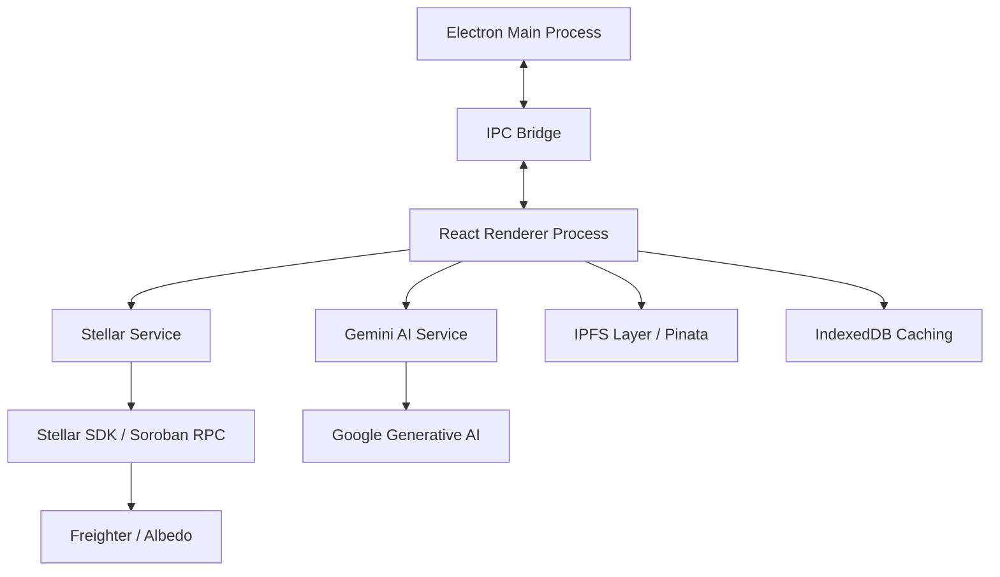

# Architecture

SocialFlow is architected as a robust, secure **Electron Desktop Application**, providing local-first data integrity for blockchain operations.

## System Architecture

## Core Components

### Electron Main Process
- Manages application lifecycle
- Handles system-level operations
- Provides secure IPC communication
- Manages window creation and state

### React Renderer Process
- User interface layer
- Component-based architecture
- State management with React hooks
- Real-time updates and notifications

### IPC Bridge
- Secure communication between main and renderer
- Message validation and sanitization
- Event-driven architecture
- Type-safe message passing

## Service Layer

### Stellar Service
Handles all blockchain interactions:
- Wallet connection management
- Transaction building and signing
- Asset creation and management
- Smart contract deployment

### Gemini AI Service
Powers intelligent content generation:
- Multi-platform content optimization
- Sentiment analysis
- Automated response generation
- Hashtag and media suggestions

### Transaction Queue
Manages blockchain transaction lifecycle:
- Queue management
- Retry logic
- Error handling
- Status tracking

## Data Layer

### IndexedDB Caching
- Local data persistence
- Offline capability
- Performance optimization
- Draft management

### IPFS Integration
- Decentralized content storage
- Metadata anchoring
- Content addressing
- Pinata pinning service

## Security Architecture

### Non-Custodial Design
- No private key storage
- Wallet extension integration
- User-controlled signing
- Zero-knowledge architecture

### IPC Security
- Message validation
- Origin verification
- Sanitized data transfer
- Secure context isolation

## Technology Stack

- **Frontend**: React 18, TypeScript, Tailwind CSS
- **Desktop**: Electron 28
- **Build**: Vite 5
- **Blockchain**: Stellar SDK, Soroban
- **AI**: Google Generative AI (Gemini)
- **Storage**: IndexedDB, IPFS/Pinata
- **UI Components**: Lucide React, Recharts

## Design Principles

1. **Local-First**: Sensitive operations on user's machine
2. **Non-Custodial**: Never access private keys
3. **Modular**: Decoupled services and components
4. **Type-Safe**: Full TypeScript implementation
5. **Performant**: Optimized rendering and caching
6. **Secure**: Defense-in-depth security model
